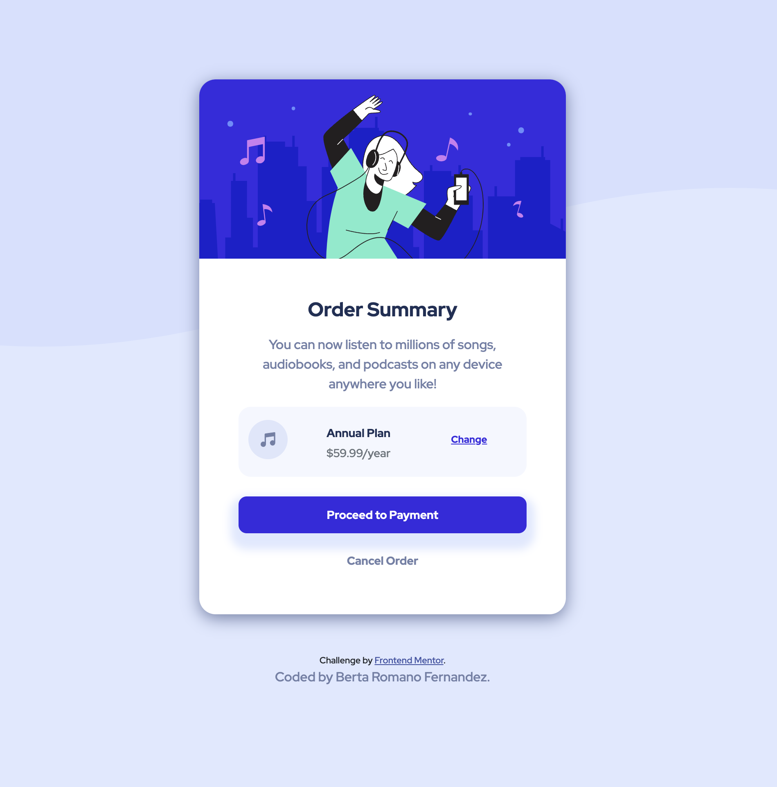

# Frontend Mentor - Order summary card solution

## Table of contents

- [Overview](#overview)
  - [The challenge](#the-challenge)
  - [Screenshot](#screenshot)
  - [Links](#links)
- [My process](#my-process)
  - [Built with](#built-with)
  - [What I learned](#what-i-learned)
  - [Useful resources](#useful-resources)
- [Author](#author)


## Overview

### The challenge

Build a responsive design for an Order Summary card from mock-up pictures.

Users should be able to:

- See hover states for interactive elements

### Screenshot



### Links

- Solution URL: [https://github.com/berta-rf/order-summary-component-main](https://github.com/berta-rf/order-summary-component-main)
- Live Site URL: [https://berta-rf.github.io/order-summary-component-main](https://berta-rf.github.io/order-summary-component-main)

## My process

### Built with

- HTML5
- CSS custom properties
- Bootstrap 5.2
- SCSS
- Mobile-first workflow

### What I learned

This is my first ever project using Bootstrap and SCSS. See a couple of code snippets that show how I used SCSS to add custom bootstrap theme colours and merged it with the theme colours.

```css

#change-link {
    color: $brightblue;
    font-size: 12px;
}

#change-link:hover {
    color: $activepurple;
    text-decoration: none;

}
```
```scss

@import "../node_modules/bootstrap/scss/functions";
@import "../node_modules/bootstrap/scss/variables";

$custom-theme-colors: (
    "paleblue": hsl(225, 100%, 94%),
    "brightblue": hsl(245, 75%, 52%),
    "verypb": hsl(225, 100%, 98%),
    "desatblue": hsl(224, 23%, 55%),
    "darkblue": hsl(223, 47%, 23%),
    "activepurple":hsl(245, 63%, 65%),
);

$theme-colors: map-merge($custom-theme-colors, $theme-colors);
```

### Useful resources

- [The Net Ninja - Bootstrap 5 Tutorial](https://www.youtube.com/watch?v=O_9u1P5YjVc&list=PL4cUxeGkcC9joIM91nLzd_qaH_AimmdAR) - This is a great 20 episode Boostrap 5 crash course. I'd recommend it to anyone starting with Bootstrap.


## Author

- GitHub - [berta-rf](https://github.com/berta-rf)
- LinkedIn - [Berta Romano Fernandez](https://www.linkedin.com/in/berta-romano-fernandez-85a51117a/)
- Frontend Mentor - [@berta-rf](https://www.frontendmentor.io/profile/)

